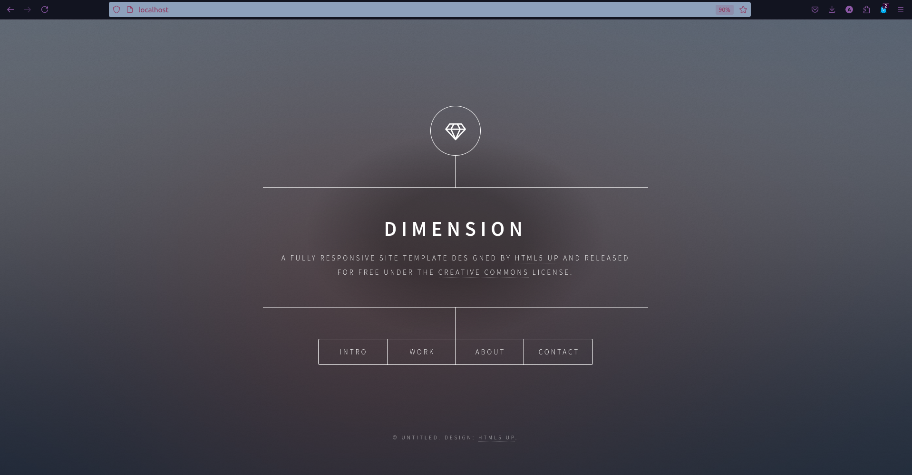

# Devops Task 3

## Description
this is a documentation on how you can server a static website with Nginx on a Ubuntu server.

## Steps
1. **Update the package list:**
   - Run the following command to update the package list:
     ```bash
     sudo apt update
     ```
2. **Install Nginx:** 
   - Run the following command to install Nginx:
     ```bash
     sudo apt install nginx
     ```
3. **Start Nginx:** 
   - Run the following command to start the Nginx service:
     ```bash
     sudo systemctl start nginx
     ```
4. **Enable Nginx:** 
   - Run the following command to enable the Nginx service to start on boot:
     ```bash
     sudo systemctl enable nginx
     ```
5. Put your website files in the `/var/www/devops` directory.
6. **Create a new configuration file:** 
   - Create a new configuration file for your website in the `/etc/nginx/conf.d` directory.
   - Run the following command to create the file:
     ```bash
     sudo nano /etc/nginx/conf.d/devops.conf
     ```
   - Add the following configuration to the file:
     ```nginx
     server {
         listen 80;
         server_name devops.com;
         root /var/www/devops;
         index index.html;
     }
     ```
7. **Test the configuration:** 
   - Run the following command to test the Nginx configuration:
     ```bash
     sudo nginx -t
     ```
8. **Reload Nginx:** 
   - Run the following command to reload the Nginx service:
     ```bash
     sudo systemctl reload nginx
     ```
9. **Access your website:** 
   - Open a web browser and enter `http://localhost/80` in the address bar.
   - You should see your static website served by Nginx.
   